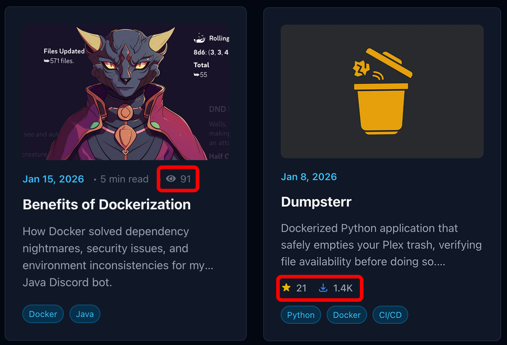
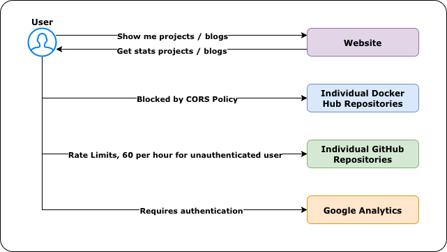
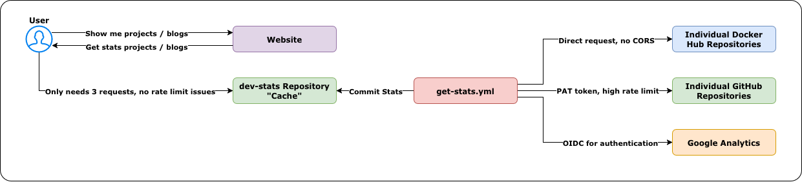

# dev-stats

Automated tracking of statistics for my Docker Hub images, GitHub repositories, and blog analytics.

## Overview

This repository fetches statistics from Docker Hub (number of pulls), GitHub (number of stars), and Google Analytics (number of blog post views) every 6 hours via GitHub Actions and stores them in JSON files. The data is consumed by [chase-roohms.github.io](https://github.com/chase-roohms/chase-roohms.github.io) to display [project stats](https://github.com/chase-roohms/chase-roohms.github.io/blob/main/src/utils/projectStats.ts) and [blog metrics](https://github.com/chase-roohms/chase-roohms.github.io/blob/main/src/utils/blogStats.ts).

<div align="center">
  
  <p><em>Stats shown on blog and project cards</em></p>
</div>

## Why?

*The root of the problem is that my website is purely static and hosted via GitHub pages. I considered changing this but the added cost of hosting a backend was not worth it to me when I knew I could come up with a viable workaround.*

- **GitHub Stats:** GitHub has a rate limit of 60 request per hour for unauthenticated users, meaning you can not have users directly request your star count from GitHub if you have a substantial amount of projects
- **Docker Hub Stats:** Docker Hub has a strict CORS policy meaning you cannot redirect your users to get data from there while on your website
- **Google Analytics:** This one is a bit self explanatory, its a private resource that you cannot (and should not) let unauthenticated users see

### The Old Way
Direct requests to GitHub would periodically fail due to rate limits, to Docker Hub required a **slow** 3rd party CORS proxy, and to Google Analytics were impossible.
<div align="center">
  <picture>
    <source media="(prefers-color-scheme: dark)" srcset="images/dev-stats-old-dark.png"/>
    <source media="(prefers-color-scheme: light)" srcset="images/dev-stats-old-light.png"/>
    
  </picture>
</div>

### The New Way
Every 6 hours this repository grabs the data from the requires sites and stores it in JSON files in this repository. Now every visitor needs to make only 3 requests to GitHub (one for each file) rather than make 2 requests per each project, and 1 request per blog post.
<div align="center">
  <picture>
    <source media="(prefers-color-scheme: dark)" srcset="images/dev-stats-new-dark.png"/>
    <source media="(prefers-color-scheme: light)" srcset="images/dev-stats-new-light.png"/>
    
  </picture>
</div>

## Features

- **Docker Hub Stats**: Automatically fetches all repositories for a specified namespace
  - Pull counts
  - Star counts
  - Repository descriptions
  - Last updated timestamps
  
- **GitHub Stats**: Automatically fetches all repositories for a user
  - Star counts
  - Fork counts
  - Watcher counts
  - Open issues counts

- **Google Analytics Stats**: Fetches page view statistics for blog posts
  - Total page views per blog post
  - All-time statistics

## Project Structure

```
dev-stats/
├── src/
│   ├── fetch-dockerhub-stats.py      # Fetch Docker Hub statistics
│   ├── fetch-github-stats.py         # Fetch GitHub statistics
│   ├── fetch-google-analytics-stats.py # Fetch Google Analytics statistics
│   ├── dh_api/                       # Docker Hub API module
│   │   ├── __init__.py
│   │   └── dh_rest.py
│   ├── gh_api/                       # GitHub API module
│   │   ├── __init__.py
│   │   └── gh_rest.py
│   └── ga_api/                       # Google Analytics API module
│       ├── __init__.py
│       └── ga_rest.py
├── data/
│   ├── dockerhub-stats.json          # Docker Hub statistics output
│   ├── github-stats.json             # GitHub statistics output
│   └── google-analytics-stats.json   # Google Analytics statistics output
├── fetch_stats.py                    # Legacy Docker Hub stats script
└── requirements.txt
```

## Usage

### Docker Hub Statistics

Fetches all repositories for the configured namespace:

```bash
pip install -r requirements.txt
cd src
python fetch-dockerhub-stats.py
```

Configure the namespace in `src/fetch-dockerhub-stats.py`:
```python
namespace = "neonvariant"  # Change to your Docker Hub namespace
```

### GitHub Statistics

Fetches all repositories for the configured user:

```bash
pip install -r requirements.txt
cd src
python fetch-github-stats.py
```

Configure the user in `src/fetch-github-stats.py`:
```python
owner = "chase-roohms"  # Change to your GitHub username
```

### Google Analytics Statistics

Fetches page view statistics for blog posts:

```bash
pip install -r requirements.txt
cd src
python fetch-google-analytics-stats.py
```

**Configuration via environment variables:**

```bash
# Required: Your GA4 Property ID
export GA4_PROPERTY_ID="123456789"

# For local development: Path to service account credentials JSON file
export GOOGLE_APPLICATION_CREDENTIALS="/path/to/credentials.json"

# For GitHub Actions: Uses Workload Identity Federation (OIDC)
# No credentials needed - authentication handled automatically via OIDC token exchange

# Optional: Blog path prefix (default: "/blog/")
export BLOG_PATH_PREFIX="/blog/"
```

**Setting up Google Analytics API access:**

1. Go to [Google Cloud Console](https://console.cloud.google.com/)
2. Create a new project or select an existing one
3. Enable the Google Analytics Data API
4. Create a service account:
   - Go to "IAM & Admin" > "Service Accounts"
   - Click "Create Service Account"
   - Grant it the "Viewer" role
   - Create and download a JSON key file
5. Add the service account email to your Google Analytics property:
   - Go to Google Analytics Admin
   - Select your property
   - Go to "Property Access Management"
   - Add the service account email with "Viewer" permissions

**For GitHub Actions (Recommended - Workload Identity Federation):**

This is the most secure method as it doesn't require storing service account keys.

1. **Set up Workload Identity Federation in Google Cloud:**
   ```bash
   # Set variables
   PROJECT_ID="your-project-id"
   PROJECT_NUMBER=$(gcloud projects describe "${PROJECT_ID}" --format="value(projectNumber)")
   SERVICE_ACCOUNT="analytics-reader@${PROJECT_ID}.iam.gserviceaccount.com"
   WORKLOAD_IDENTITY_POOL="github-pool"
   WORKLOAD_IDENTITY_PROVIDER="github-provider"
   REPO="your-username/your-dev-stats-repo"
   
   echo "Project ID: ${PROJECT_ID}"
   echo "Project Number: ${PROJECT_NUMBER}"
   
   # Enable required APIs
   gcloud services enable iamcredentials.googleapis.com --project="${PROJECT_ID}"
   gcloud services enable analyticsdata.googleapis.com --project="${PROJECT_ID}"
   
   # Create Workload Identity Pool
   gcloud iam workload-identity-pools create "${WORKLOAD_IDENTITY_POOL}" \
     --project="${PROJECT_ID}" \
     --location="global" \
     --display-name="GitHub Actions Pool"
   
   # Create Workload Identity Provider
   gcloud iam workload-identity-pools providers create-oidc "${WORKLOAD_IDENTITY_PROVIDER}" \
     --project="${PROJECT_ID}" \
     --location="global" \
     --workload-identity-pool="${WORKLOAD_IDENTITY_POOL}" \
     --display-name="GitHub Provider" \
     --attribute-mapping="google.subject=assertion.sub,attribute.actor=assertion.actor,attribute.repository=assertion.repository,attribute.repository_owner=assertion.repository_owner" \
     --attribute-condition="assertion.repository == '$REPO'" \
     --issuer-uri="https://token.actions.githubusercontent.com"
   
   # Allow the GitHub repo to impersonate the service account
   gcloud iam service-accounts add-iam-policy-binding "${SERVICE_ACCOUNT}" \
     --project="${PROJECT_ID}" \
     --role="roles/iam.workloadIdentityUser" \
     --member="principalSet://iam.googleapis.com/projects/${PROJECT_NUMBER}/locations/global/workloadIdentityPools/${WORKLOAD_IDENTITY_POOL}/attribute.repository/${REPO}"
   ```

2. **Add GitHub repository secrets:**
   - Go to your GitHub repository settings
   - Navigate to "Secrets and variables" > "Actions"
   - Create these repository secrets:
     - `GA4_PROPERTY_ID`: Your GA4 property ID (e.g., "516541379")
     - `GCP_WORKLOAD_IDENTITY_PROVIDER`: Full provider name (e.g., `projects/PROJECT_NUMBER/locations/global/workloadIdentityPools/github-pool/providers/github-provider`)
     - `GCP_SERVICE_ACCOUNT`: Service account email (e.g., `analytics-reader@PROJECT_ID.iam.gserviceaccount.com`)

3. **The workflow will authenticate automatically** - see [.github/workflows/get-stats.yml](.github/workflows/get-stats.yml) for the implementation

**Alternative: Using Service Account Keys (Less Secure):**

If you can't use Workload Identity Federation:

1. Copy the entire contents of your service account JSON file
2. Go to your GitHub repository settings
3. Navigate to "Secrets and variables" > "Actions"
4. Create these repository secrets:
   - `GA4_PROPERTY_ID`: Your GA4 property ID
   - `GOOGLE_CREDENTIALS_JSON`: Paste the entire JSON file contents

### Automated Updates

All three scripts run every 6 hours via GitHub Actions to keep statistics current.

## Output Format

### Docker Hub Stats (`data/dockerhub-stats.json`)

```json
{
  "last_updated": "2026-01-20T12:00:00Z",
  "namespace": "neonvariant",
  "totals": {
    "total_pulls": 5000,
    "total_stars": 25
  },
  "repositories": {
    "neonvariant/mythicmate": {
      "pull_count": 3000,
      "star_count": 15,
      "description": "Repository description",
      "last_updated": "2026-01-20T10:00:00Z"
    }
  }
}
```

### Google Analytics Stats (`data/google-analytics-stats.json`)

```json
{
  "last_updated": "2026-01-30T12:00:00Z",
  "property_id": "516541379",
  "blog_path_prefix": "/blog/",
  "totals": {
    "total_blog_posts": 25,
    "total_page_views": 50000
  },
  "blog_posts": {
    "/blog/my-first-post/": {
      "page_views": 5000
    }
  }
}
```

### GitHub Stats (`data/github-stats.json`)

```json
{
  "last_updated": "2026-01-20T12:00:00Z",
  "totals": {
    "total_stars": 100,
    "total_forks": 20,
    "total_watchers": 50,
    "total_open_issues": 5
  },
  "repositories": {
    "dev-stats": {
      "stars": 10,
      "forks": 2,
      "watchers": 5,
      "open_issues": 1,
      "description": "Repository description"
    }
  }
}
```

## API Modules

All three API modules feature:
- Rate limiting with automatic backoff
- Request retry logic with exponential backoff (GitHub/Docker Hub)
- Data caching (5-minute TTL)
- Comprehensive logging
- Context manager support for proper session cleanup (GitHub/Docker Hub)

The Google Analytics module uses the official `google-analytics-data` Python client library.
